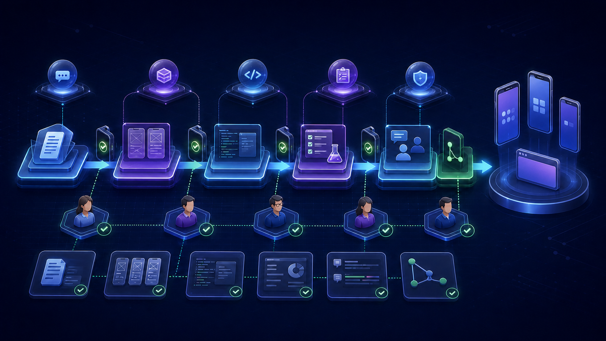
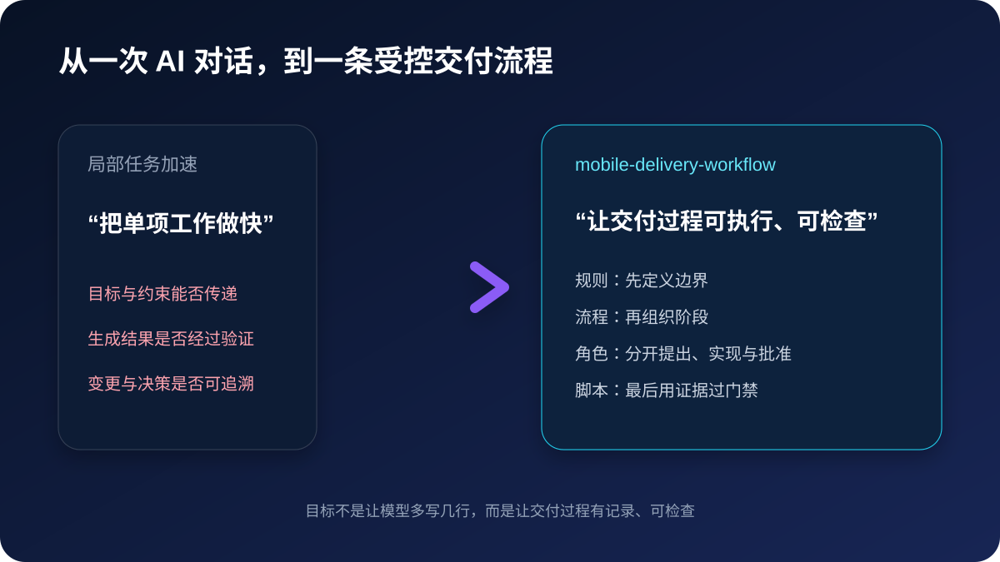
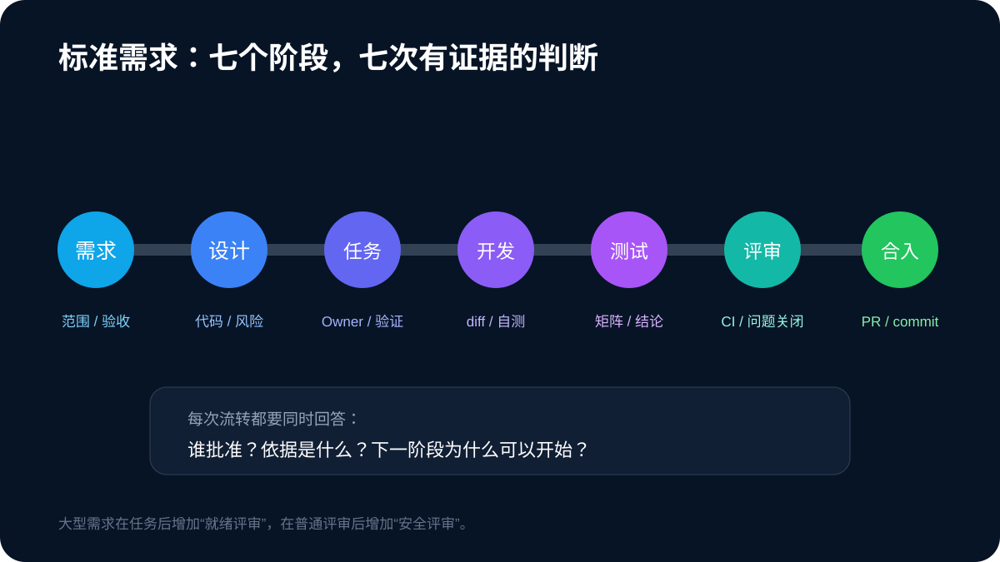
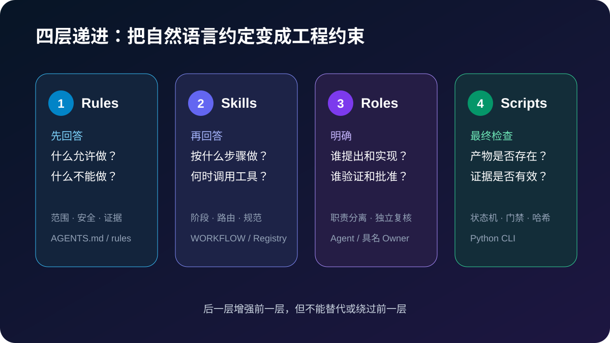
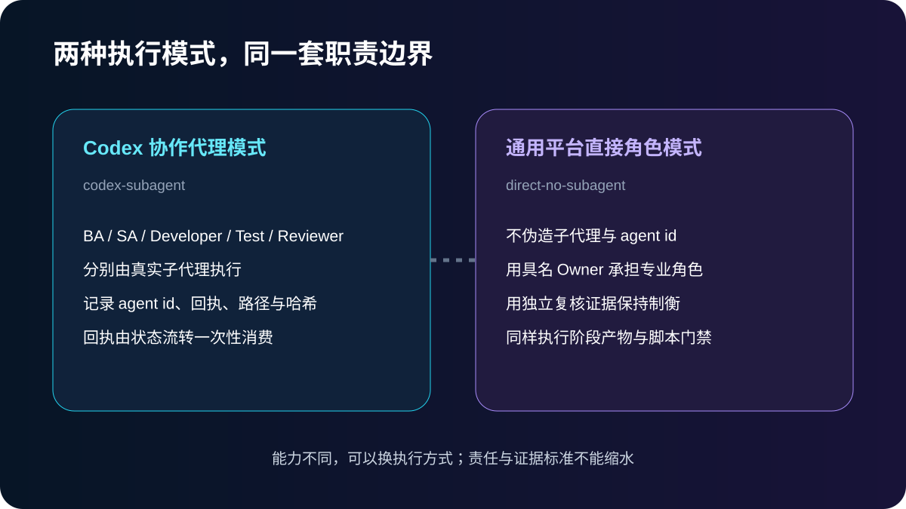
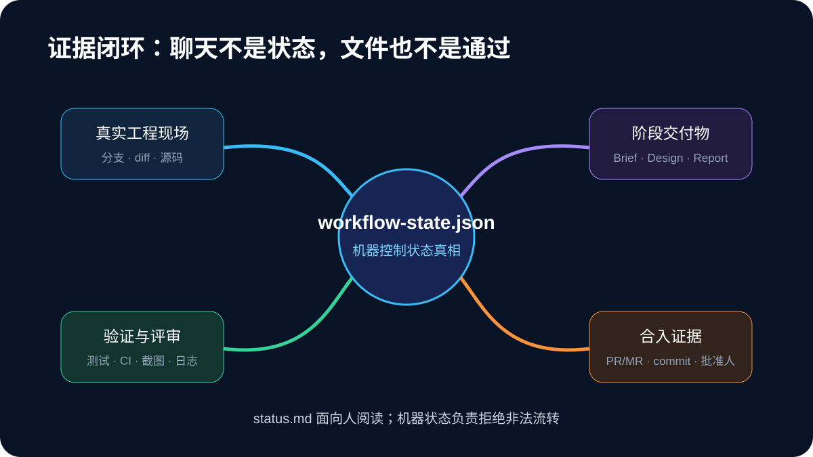

> `mobile-delivery-workflow` 是一套接入现有代码仓库的移动端需求交付工作流。它负责组织需求、设计、开发、测试、评审和合入，不负责替代编码规范、构建系统、CI 或人工批准。



让 AI 写出一段代码并不难。难的是，当一个需求跨过产品、技术、开发、测试和评审之后，团队还能说清楚：现在做到哪一步，下一步由谁负责，什么条件满足后才能继续，以及“已经完成”究竟有什么依据。

`mobile-delivery-workflow` 处理的就是这件事。它把交付规则、角色职责、阶段状态和验证证据放进项目仓库，让 AI、开发者和评审人围绕同一份项目记录工作。对话可以结束，执行平台可以切换，但需求状态和判断依据不会只留在某个人的聊天记录里。

## 一、这个项目解决什么问题

AI 可以协助分析需求、查找代码、生成实现和整理文档，但这些只是交付过程中的局部工作。一个改动要进入真实项目，还要回答很多相互关联的问题：需求边界是否确认，技术方案是否经过批准，代码是否在目标环境中验证，测试和评审是否完成，最终合入的是不是同一份代码。

如果这些信息只存在于对话中，换一个人、换一个 Agent，或者隔几天再继续，任务就很容易从头解释。更麻烦的是，代码可能已经改了，状态文档还停留在需求阶段；也可能文件都齐了，但测试、CI 或评审依据并不存在。

这个项目关注的是局部执行和完整交付之间的落差。要让 AI 生成的内容进入真实研发流程，目标和约束要能传到后续阶段，生成结果要有人验证，变更与决定也要能够追溯。



`mobile-delivery-workflow` 的定位，是放在现有仓库里的交付编排层：读取真实项目，建立需求工作区，安排阶段和角色，在流转前检查产物与证据。代码生成和日常项目管理仍由团队原有工具承担。

## 二、一次需求如何走完整条流程

项目把具有独立生命周期和验收结果的交付单元称为 Feature。一个页面、一个需求文件或一个开发任务不一定就是一个 Feature；只有能够独立验收、发布或决定退役的范围，才适合单独建立工作区。

一项新需求进入后，工作流先做三件事。

首先确认它属于哪个项目、哪个平台，边界是否与已有 Feature 重复。随后判断需求规模。小型需求走精简流程；标准需求经过需求、设计、任务拆分、开发、测试、评审和合入；大型需求还会增加就绪评审与安全评审。最后根据仓库里的代码、文档、测试和发布记录判断真实起点。

这一步很重要，因为接入对象不一定是尚未开发的新需求。正在开发、测试或评审的存量需求，可以从当前阶段进入；已经上线的需求采用证据回填；已经废弃的需求只记录决定和原因。工作流不会因为缺少早期文档，就把一个已经上线的功能重新判定为“需求阶段”。

标准需求的主流程如下。



每个阶段都有自己的输入、产物、责任人、允许结果和退出条件。需求阶段确认范围与验收标准；设计阶段说明代码现状、方案和风险；任务拆分阶段确定负责人和验证方式；开发阶段提交实际 diff 与本地验证；测试和评审阶段给出各自结论；合入阶段记录目标分支、PR 或 MR 以及对应 commit。

阶段没有通过时，流程不会靠一句“继续”向前跳。测试失败或评审拒绝会回到开发，阻塞则保留当前问题。只有合入阶段通过，Feature 才进入完成状态。

## 三、工作流由哪些部分组成

项目使用 `Rules → Skills → Roles → Scripts` 四层结构。这四层从规则到执行逐层收紧，共同决定一个阶段能否推进。



### Rules：先确定什么可以做

Rules 规定写入范围、安全边界、证据要求和禁止动作。接入项目后，这些规则位于 `docs/ai-delivery/rules/`，并由仓库根目录的 `AGENTS.md` 引导 Agent 读取。后续 Skill、角色和脚本都不能绕过这些规则。

### Skills：决定当前阶段怎样做

主 Skill 负责识别需求规模和当前阶段，再按平台与任务类型选择专业 Skill。例如，真正修改 iOS、Android、HarmonyOS 或 H5 代码时，需要继续遵守相应平台的编码与验证要求。项目中的 `SKILL_REGISTRY.md` 记录可选能力、触发条件和本机状态，单个 Feature 的实际选择则写进自己的状态文件。

### Roles：把产出和批准分开

标准需求包含业务分析、解决方案设计、开发、测试和代码评审等职责。大型需求还会增加就绪评审和安全评审。需求作者不能同时批准自己的需求，方案作者不能同时批准自己的方案，开发者也不能审核自己的代码。脚本可以检查角色字段和身份冲突，但现实中的人员身份仍由团队负责确认。

### Scripts：执行机械检查

Python 脚本负责初始化文件、维护机器状态、创建阶段产物、校验当前门禁和执行合法流转。它能识别文件缺失、Owner 未填写、角色冲突、任务未完成、证据为空、结果不合法或状态陈旧，但不会替人判断方案是否合理、代码是否正确。

项目接入后，仓库中的主要结构如下：

```text
<repo>/
├── AGENTS.md
└── docs/
    ├── ai-delivery/
    │   ├── rules/
    │   ├── agent-contracts/
    │   ├── templates/
    │   ├── WORKFLOW.md
    │   ├── SKILL_REGISTRY.md
    │   └── MCP_REGISTRY.md
    └── features/
        └── <feature>/
            ├── README.md
            ├── status.md
            ├── workflow-state.json
            └── 按阶段生成的交付文档
```

`docs/ai-delivery/` 保存项目长期使用的规则和模板，`docs/features/<feature>/` 保存某一项需求自己的状态与证据。两者分开后，更新通用流程不会混入某个需求的执行记录。

## 四、如何接入现有项目

项目级初始化通常只执行一次。使用时可以直接告诉 Agent“给当前移动端项目接入 AI 需求交付流程”，Agent 会先检查仓库中的构建文件、模块、现有文档和 `AGENTS.md`，再执行接入。

下面的命令是底层脚本入口，也可以用于人工检查或调试。它在 `docs/ai-delivery/` 下增量创建规则、工作流、Skill/MCP 注册表、角色契约和模板：

```bash
python3 <skill-dir>/scripts/init_project.py \
  --root <repo> \
  --project-name "<项目名>" \
  --platform "<iOS|Android|HarmonyOS|H5|跨端>" \
  --owner "<流程负责人>"
```

初始化器默认只创建缺失文件，不覆盖已有资产。根 `AGENTS.md` 不由这个脚本凭空生成，而要根据真实仓库的模块、构建方式和现有约定创建或增量维护，再把 Agent 路由到 `docs/ai-delivery/`。

接入完成后还要复核两个注册表。`SKILL_REGISTRY.md` 中的安装情况只是初始化机器当时的快照；`MCP_REGISTRY.md` 中的已配置状态也不代表当前宿主一定可以调用。真正进入开发或测试前，仍需检查相关能力在本次会话中是否可见，并对目标工程执行一次实际探针。

这套接入方式不会替换原来的 README、CI、分支策略或平台工程规范。它把现有规则纳入交付路径，而不是要求团队迁移到另一套研发工具。

## 五、如何创建和推进一个 Feature

创建 Feature 时，可以直接要求 Agent“为这个需求建立标准交付记录，并从当前真实阶段接入”。Agent 需要结合需求内容和仓库证据确定名称、目标仓库、规模、平台、生命周期和执行模式，而不是要求用户先理解全部脚本参数。

下面是一项尚未开发的标准需求所对应的底层命令：

```bash
python3 <skill-dir>/scripts/init_feature.py "<需求名称>" \
  --root <repo> \
  --size standard \
  --platform "<目标平台>" \
  --lifecycle 未开发 \
  --owner "<负责人>" \
  --execution-mode direct-no-subagent
```

标准需求初始化时只创建 `README.md`、`status.md`、`workflow-state.json` 和 `feature-brief.md`。技术方案、任务清单、测试报告和评审报告会在对应阶段开始时再创建。这样既能减少空模板，也能防止仅靠手工补文件伪造阶段推进。

项目支持三种规模：

| 规模 | 适用条件 | 流程 |
|---|---|---|
| 小型 | 目标和验收可用一句话说明；单仓单模块；不修改 API、协议或数据结构；不涉及登录、权限、隐私、安全、支付、迁移或多平台联动；改动容易回退，通常不超过一个开发日 | 开发与自测 → 评审 → 合入 |
| 标准 | 需要需求澄清、技术设计、任务拆分、测试或多人协作，但没有大型需求的高风险特征 | 需求 → 设计 → 任务拆分 → 开发 → 测试 → 评审 → 合入 |
| 大型 | 跨平台、跨团队、架构变化、数据迁移、安全合规或发布编排复杂 | 标准流程增加就绪评审和安全评审 |

任一小型条件不满足，就进入标准流程。开发过程中发现范围或风险扩大，也应升级需求规模，而不是为了少写文档继续走轻量路径。

流程同时维护两种状态。`observed_phase` 表示从代码、测试、CI、评审或发布记录中观察到的真实进度；`control_phase` 表示当前允许执行的门禁。前者回答“工程实际上做到哪了”，后者回答“流程现在允许做什么”。

`status.md` 把这两种状态和负责人、证据说明整理给人看，`workflow-state.json` 则保存脚本使用的控制字段、角色绑定和流转历史。脚本可以用下面的命令检查两者是否一致：

```bash
python3 <skill-dir>/scripts/workflow_state.py verify \
  --root <repo> --feature <feature-slug>

python3 <skill-dir>/scripts/validate_feature.py \
  --root <repo> --feature <feature-slug> --stage <当前阶段>
```

通过校验后，具名责任人才可以携带证据执行阶段流转。确认过的业务约束、接受风险或“不属于问题”的判断，也应写入 Feature 状态和机器历史，不能只停留在聊天中。

## 六、两种执行模式有什么区别

`mobile-delivery-workflow` 可以在支持 Codex 协作代理的环境中运行，也可以在没有子代理能力的平台上运行。两种模式使用同一套阶段、角色和证据要求，区别只在于专业角色由什么载体执行。



### `codex-subagent`

当宿主真实提供 `spawn_agent` 和 `wait_agent` 时，主 Agent 负责识别阶段、准备上下文、派发任务和执行门禁，业务分析、方案设计、开发、测试及评审分别交给相应子代理。协议会登记 Codex 返回的规范任务名、运行次数、修改路径、产物哈希和结果，并要求一次完成回执只能被一次匹配流转消费。

Python 脚本不会自己创建子代理，也不能单独证明某个标识确实来自 Codex。工具返回值才是来源，脚本只负责检查格式、时序、写入范围和回执使用规则。

### `direct-no-subagent`

当宿主没有协作代理能力时，Feature 默认使用这一模式。它不会伪造 Agent 标识，而是把职责绑定到具名人员或直接角色，并要求独立复核证据。没有子代理并不等于同一个主体可以包办全部工作；开发和评审、产出和批准仍需分开。

Feature 在两类宿主之间转移时可以切换执行模式，但前提是当前没有仍在运行的代理任务。切换点会写入历史，旧模式下的回执不能拿到新模式中继续使用。

## 七、什么可以作为通过依据

项目把证据理解为能够定位、能够复核的记录，而不是“已完成”“验证过”这样的结论。



命令验证要记录实际命令和结果；界面验证要给出截图或录屏路径；CI 要记录任务、流水线或运行编号；评审要记录阻塞问题及其关闭情况；合入要对应目标分支、PR 或 MR、源 commit、合入 commit、Reviewer 和合入人。

文件存在也不等于门禁通过。`validate_feature.py` 会继续检查必需章节、具名 Owner、任务状态、测试结论、评审元数据和未关闭问题。评审结论又分为代码是否需要修改、证据是否齐全和阶段是否可以通过。代码本身没有发现问题，但 CI 或测试依据不足时，应该记录为 `BLOCK`，而不是 `PASS`。

脚本能做的是机械校验。它可以发现“没有填写证据”，不能判断截图是否真的覆盖验收场景；可以发现开发者与 Reviewer 同名，不能确认两个不同名字是否实际由同一人操作；可以校验 commit 字段存在，不能证明该构建产物一定来自这个 commit。这些事实仍需责任人结合工程现场确认。

## 八、项目适合什么场景

这套工作流适合已经有代码仓库、构建方式和团队分工，希望让 AI 参与真实研发流程的移动端项目。支持范围包括 iOS、Android、HarmonyOS、H5，以及同时涉及多个端的需求。它尤其适合阶段多、交接频繁、需要保留审批和验证依据的改动。

如果任务只是一次性的代码试验，不进入测试、评审和合入流程，完整工作流可能过重，可以使用小型需求记录，或者不建立 Feature。相反，跨平台、安全合规、数据迁移和复杂发布任务不应为了追求轻量而压缩成小型流程。

当前仓库能够确认的是，项目已经提供增量初始化、需求分级、生命周期接入、阶段状态机、角色分离、门禁校验、证据记录和两种执行模式。源码存在这些机制，不等于它已经在所有团队和项目中完成验证，也不能直接推出效率、缺陷率或发布质量的改善。

`mobile-delivery-workflow` 会在仓库中留下与代码共同演进的交付记录：当前阶段是什么，谁可以继续操作，哪些条件已经满足，哪些问题仍然阻塞，以及每次决定依据什么作出。下一位接手者可以从这些记录继续工作，不必先还原上一段对话。

---

> 项目形态：Codex Skill / 通用 AI 交付工作流（`mobile-delivery-workflow`）<br>
> 支持范围：iOS、Android、HarmonyOS、H5 及跨端移动项目<br>
> 事实边界：本文依据当前仓库中的 Skill 定义、流程模板、角色契约和 Python 脚本介绍项目，不把源码中的机制等同于未经验证的实际效果
